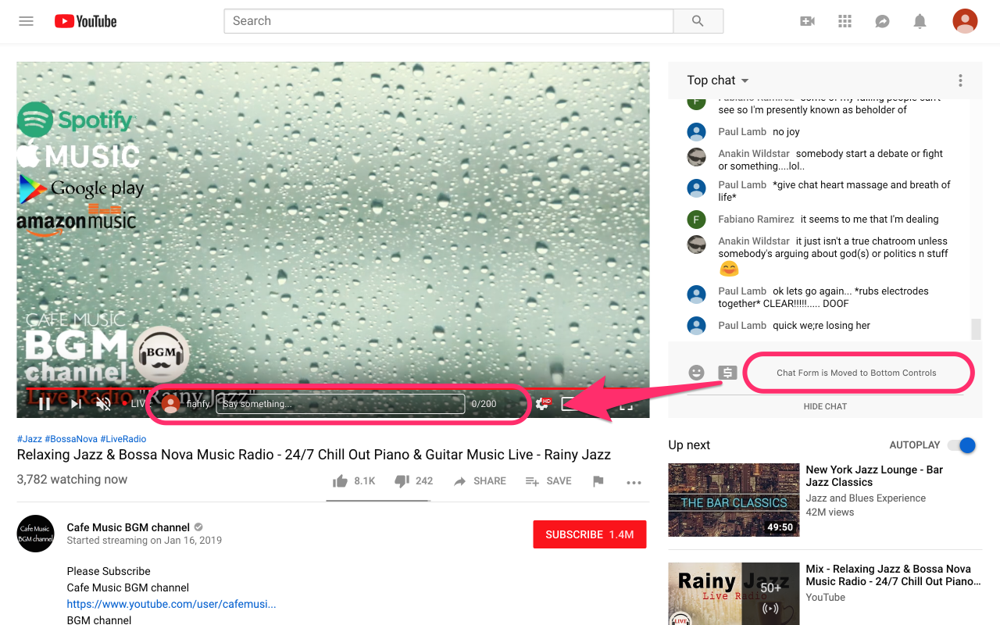

# YouTube Live Chat Flow


> Chrome Extension for Chat Messages Flow on YouTube Videos.

## Features

- Messages flow over a video.
- Change message color, size and speed.
- Show author and avatar on messages.
- Show super chats and super stickers.
- Filter banned words.
- Move chat form to bottom controls on video.

## Screenshots




## Installation

1. Download `archive.zip` from [releases page](https://github.com/fiahfy/youtube-live-chat-flow/releases) and unzip this file.
2. Open the Extension Management page by navigating to `chrome://extensions`.
3. Enable Developer Mode by clicking the toggle switch next to **Developer mode**.
4. Click the **LOAD UNPACKED** button and select the unpacked directory named `app`.

## Development

```bash
# install dependencies
yarn

# watch files changed and reload extension
yarn dev
```
